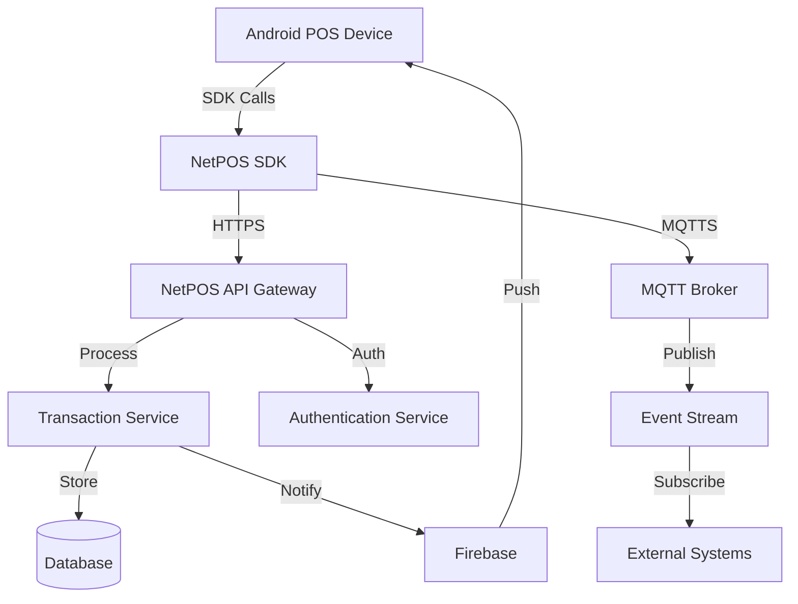

NetPOS provides multiple integration options to help you build powerful point-of-sale solutions and connect external systems to your POS infrastructure.

## Integration Options

NetPOS offers three primary integration methods:

<CardGroup cols={3}>
  <Card title="SDK Integration" icon="mobile" href="/integration/sdk-setup">
    Embed NetPOS functionality directly into your Android application
  </Card>
  
  <Card title="MQTT Notifications" icon="broadcast-tower" href="/integration/mqtt-integration">
    Real-time event streaming for transactions, authentication, and device events
  </Card>
  
  <Card title="REST API" icon="code" href="/integration/api-endpoints">
    HTTP endpoints for transactions, user management, and data retrieval
  </Card>
</CardGroup>

## Common Use Cases

### Point-of-Sale Applications

Integrate the NetPOS SDK to build custom POS applications with:

- Card payment processing (contact and contactless)
- QR code payments (MasterPass, NIBSS, Zenith)
- Transaction management and reporting
- Receipt printing
- Device configuration

### Backend Integration

Connect your backend systems using:

- **REST APIs** for transaction queries, user authentication, and data synchronization
- **MQTT** for real-time transaction notifications and device monitoring
- **Webhooks** (Firebase Cloud Messaging) for push notifications

### Multi-Channel Commerce

Build unified commerce experiences:

- Synchronize in-store and online transactions
- Real-time inventory updates
- Unified customer profiles
- Cross-channel analytics

## Architecture Overview

NetPOS follows a distributed architecture:

<Steps>
  <Step title="Device Initialization">
    The NetPOS SDK initializes on app startup, loading EMV parameters and terminal configuration.
  </Step>
  
  <Step title="Authentication">
    Users authenticate via the REST API, receiving JWT tokens for subsequent requests.
  </Step>
  
  <Step title="Transaction Processing">
    Transactions are processed through the SDK and logged to both local database and backend API.
  </Step>
  
  <Step title="Event Publishing">
    Transaction events are published to MQTT topics for real-time monitoring.
  </Step>
  
  <Step title="Notification Delivery">
    Firebase Cloud Messaging delivers push notifications for important events.
  </Step>
</Steps>

## Security

All integrations use industry-standard security:

<AccordionGroup>
  <Accordion title="Transport Security">
    - TLS 1.2+ for HTTPS connections
    - MQTTS (MQTT over TLS) on port 8883
    - Certificate pinning for API clients
    - Mutual TLS authentication for MQTT
  </Accordion>
  
  <Accordion title="Authentication">
    - JWT tokens with Bearer authentication
    - Token expiration and refresh
    - Role-based access control
    - Terminal-specific credentials
  </Accordion>
  
  <Accordion title="Data Protection">
    - PCI-DSS compliant card data handling
    - Encrypted local storage
    - Sensitive data masking
    - Secure key storage (Android KeyStore)
  </Accordion>
</AccordionGroup>

## Environment Configuration

NetPOS supports multiple environments:

| Environment | API Base URL | MQTT Broker |
|------------|--------------|-------------|
| Production | `https://netpos.netpluspay.com/` | `BuildConfig.BASE_URL_NETPOS_MQTT` |
| Staging | Configured via `app-settings.properties` | Configured per environment |

Environment selection is controlled via the `env.use.mode.production` flag in your build configuration.

## Getting Started

<CardGroup cols={2}>
  <Card title="SDK Integration" icon="rocket" href="/integration/sdk-setup">
    Start with SDK setup for Android applications
  </Card>
  
  <Card title="API Integration" icon="plug" href="/integration/api-endpoints">
    Explore REST API endpoints for backend integration
  </Card>
</CardGroup>

## Support

For integration assistance:

- Technical documentation: Review the detailed integration guides
- Sample code: Available in the NetPOS repository
- Terminal configuration: Contact your NetPOS account manager