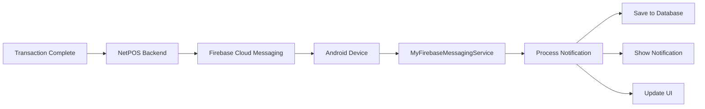

NetPOS uses Firebase Cloud Messaging (FCM) for delivering real-time webhook-style notifications to POS devices and backend systems.

## Overview

Webhook notifications provide instant updates for:

- Transaction completions (card payments, QR payments)
- Virtual account transfers
- Payment status updates
- Campaign messages
- System alerts

## Architecture

NetPOS webhook delivery uses Firebase Cloud Messaging:



## Setup

### Firebase Configuration

Add Firebase to your Android project:

<Steps>
  <Step title="Add Firebase SDK">
    Add Firebase dependencies to your `build.gradle`:
    
    ```groovy build.gradle (App)
    dependencies {
        // Firebase BOM
        implementation platform('com.google.firebase:firebase-bom:30.4.1')
        
        // Firebase Cloud Messaging
        implementation 'com.google.firebase:firebase-messaging-ktx'
        implementation 'com.google.firebase:firebase-analytics-ktx'
    }
    
    apply plugin: 'com.google.gms.google-services'
    ```
  </Step>
  
  <Step title="Add google-services.json">
    Download `google-services.json` from Firebase Console and place it in your `app/` directory
  </Step>
  
  <Step title="Initialize Firebase">
    Initialize Firebase in your Application class:
    
    ```kotlin NetPosApp.kt
    import com.google.firebase.FirebaseApp
    import com.google.firebase.ktx.Firebase
    import com.google.firebase.messaging.ktx.messaging
    
    override fun onCreate() {
        super.onCreate()
        FirebaseApp.initializeApp(this)
        
        // Subscribe to campaign notifications
        Firebase.messaging.subscribeToTopic("netpos_campaign")
            .addOnCompleteListener { task ->
                if (task.isSuccessful) {
                    Timber.e("Subscribed to campaign topic")
                }
            }
    }
    ```
  </Step>
</Steps>

### Service Implementation

Create a Firebase Messaging Service:

```kotlin MyFirebaseMessagingService.kt
package com.woleapp.netpos.services

import android.app.NotificationChannel
import android.app.NotificationManager
import android.app.PendingIntent
import android.content.Context
import android.content.Intent
import android.os.Build
import androidx.core.app.NotificationCompat
import com.google.firebase.messaging.FirebaseMessagingService
import com.google.firebase.messaging.RemoteMessage
import com.google.gson.Gson
import com.woleapp.netpos.R
import com.woleapp.netpos.model.GetZenithPayByTransferUserTransactionsModel
import com.woleapp.netpos.model.PayWithCardNotificationModelResponse
import com.woleapp.netpos.ui.activities.MainActivity
import timber.log.Timber

class MyFirebaseMessagingService : FirebaseMessagingService() {
    private val gson: Gson = Gson()

    override fun onNewToken(token: String) {
        Timber.e("New FCM token: $token")
        sendRegistrationToServer(token)
        super.onNewToken(token)
    }

    override fun onMessageReceived(remoteMessage: RemoteMessage) {
        Timber.d("Message received from: ${remoteMessage.from}")

        if (remoteMessage.data.isNotEmpty()) {
            handleTransactionMessage(remoteMessage)
            handleVirtualAccountMessage(remoteMessage)
        }
    }
    
    private fun handleTransactionMessage(remoteMessage: RemoteMessage) {
        remoteMessage.data["TransactionNotification"]?.let { notificationData ->
            val transaction: PayWithCardNotificationModelResponse = gson.fromJson(
                notificationData,
                PayWithCardNotificationModelResponse::class.java
            )
            
            // Process transaction notification
            if (transaction.email.contains(MERCHANT_QR_PREFIX)) {
                createTransactionNotification(
                    getString(
                        R.string.notification_message_body,
                        transaction.amount.toDouble().formatCurrencyAmount(),
                        transaction.status,
                        transaction.customerName,
                        transaction.maskedPan
                    )
                )
                
                // Save to database
                scheduleJobToSaveTransactionToDatabase(gson.toJson(transaction))
            }
        }
    }
    
    private fun handleVirtualAccountMessage(remoteMessage: RemoteMessage) {
        remoteMessage.data["VirtualNotification"]?.let { notificationData ->
            val transaction: GetZenithPayByTransferUserTransactionsModel = gson.fromJson(
                notificationData,
                GetZenithPayByTransferUserTransactionsModel::class.java
            )
            
            val transactionAmount = transaction.amount?.div(100) ?: 0.0
            
            sendNotification(
                "${transactionAmount.formatCurrencyAmount()} Received\n" +
                "From: ${transaction.payer_account_name} (${transaction.details})"
            )
            
            // Save to database
            scheduleJobToSaveTransactionToDatabase(gson.toJson(transaction))
        }
    }
    
    private fun sendRegistrationToServer(token: String) {
        // Register token with backend for targeted notifications
        scheduleJobToRegisterNewToken(token)
    }
}
```

### Register Service

Add the service to `AndroidManifest.xml`:

```xml AndroidManifest.xml
<service
    android:name=".services.MyFirebaseMessagingService"
    android:exported="false">
    <intent-filter>
        <action android:name="com.google.firebase.MESSAGING_EVENT" />
    </intent-filter>
</service>
```

## Webhook Payloads

### Transaction Notification

Received when a card payment completes:

```json
{
  "TransactionNotification": "{
    \"email\": \"merchant_qr_user@example.com\",
    \"amount\": 5000.00,
    \"status\": \"SUCCESS\",
    \"customerName\": \"JOHN DOE\",
    \"maskedPan\": \"506066******1234\",
    \"reference\": \"TXN202112011234\",
    \"authCode\": \"123456\",
    \"responseCode\": \"00\",
    \"timestamp\": 1638360000000
  }"
}
```

**Payload Fields:**

<ResponseField name="email" type="string">
  Merchant email (with `merchant_qr_` prefix for QR payments)
</ResponseField>
<ResponseField name="amount" type="number">
  Transaction amount in Naira
</ResponseField>
<ResponseField name="status" type="string">
  Transaction status: SUCCESS, FAILED, PENDING
</ResponseField>
<ResponseField name="customerName" type="string">
  Cardholder name
</ResponseField>
<ResponseField name="maskedPan" type="string">
  Masked card number
</ResponseField>
<ResponseField name="reference" type="string">
  Unique transaction reference
</ResponseField>
<ResponseField name="authCode" type="string">
  Authorization code from issuer
</ResponseField>
<ResponseField name="responseCode" type="string">
  ISO 8583 response code
</ResponseField>

### Virtual Account Notification

Received when a bank transfer is received:

```json
{
  "VirtualNotification": "{
    \"amount\": 500000,
    \"payer_account_name\": \"JOHN DOE\",
    \"payer_account_number\": \"1234567890\",
    \"details\": \"Transfer/0012345678\",
    \"paid_at\": \"2021-12-01T10:30:00Z\",
    \"reference\": \"NIP202112011234567\",
    \"session_code\": \"123456\"
  }"
}
```

**Payload Fields:**

<ResponseField name="amount" type="number">
  Amount in kobo (divide by 100 for Naira)
</ResponseField>
<ResponseField name="payer_account_name" type="string">
  Sender's account name
</ResponseField>
<ResponseField name="payer_account_number" type="string">
  Sender's account number
</ResponseField>
<ResponseField name="details" type="string">
  Transfer details and narration
</ResponseField>
<ResponseField name="paid_at" type="string">
  Payment timestamp (ISO 8601)
</ResponseField>
<ResponseField name="reference" type="string">
  NIP transaction reference
</ResponseField>
<ResponseField name="session_code" type="string">
  Session code used for transfer (if applicable)
</ResponseField>

## Notification Display

### Create Notification

```kotlin
private fun sendNotification(messageBody: String) {
    val intent = Intent(this, MainActivity::class.java)
    intent.action = STRING_FIREBASE_INTENT_ACTION
    intent.addFlags(Intent.FLAG_ACTIVITY_CLEAR_TOP)
    intent.putExtra(TAG_NOTIFICATION_RECEIVED_FROM_BACKEND, true)
    
    val pendingIntent = PendingIntent.getActivity(
        this,
        0,
        intent,
        PendingIntent.FLAG_IMMUTABLE
    )

    val channelId = "fcm_default_channel"
    val defaultSoundUri = RingtoneManager.getDefaultUri(RingtoneManager.TYPE_NOTIFICATION)
    
    val notificationBuilder = NotificationCompat.Builder(this, channelId)
        .setContentTitle(getString(R.string.transacion_received))
        .setStyle(NotificationCompat.BigTextStyle().bigText(messageBody))
        .setSmallIcon(R.drawable.ic_netpos_logo)
        .setContentText(messageBody)
        .setAutoCancel(true)
        .setSound(defaultSoundUri)
        .setContentIntent(pendingIntent)
        .setPriority(NotificationCompat.PRIORITY_HIGH)

    val notificationManager =
        getSystemService(Context.NOTIFICATION_SERVICE) as NotificationManager

    // Create notification channel for Android O+
    if (Build.VERSION.SDK_INT >= Build.VERSION_CODES.O) {
        val channel = NotificationChannel(
            channelId,
            getString(R.string.transacion_received),
            NotificationManager.IMPORTANCE_HIGH
        )
        notificationManager.createNotificationChannel(channel)
    }

    notificationManager.notify(0, notificationBuilder.build())
}
```

## Background Processing

Use WorkManager for reliable background processing:

```kotlin
private fun scheduleJobToSaveTransactionToDatabase(
    transactionJson: String
) {
    val inputData: Data = Data.Builder()
        .putString(WORKER_INPUT_PBT_TRANSACTION_TAG, transactionJson)
        .build()

    val constraints = Constraints.Builder()
        .setRequiredNetworkType(NetworkType.CONNECTED)
        .build()
        
    val work = OneTimeWorkRequest.Builder(
        SaveTransactionFromFirebaseMessagingServiceToDbWorker::class.java
    )
        .setConstraints(constraints)
        .setInputData(inputData)
        .build()
        
    WorkManager.getInstance(this)
        .beginWith(work)
        .enqueue()
}
```

### Worker Implementation

```kotlin SaveTransactionWorker.kt
class SaveTransactionFromFirebaseMessagingServiceToDbWorker(
    context: Context,
    params: WorkerParameters
) : Worker(context, params) {

    override fun doWork(): Result {
        val transactionJson = inputData.getString(WORKER_INPUT_PBT_TRANSACTION_TAG)
            ?: return Result.failure()
        
        return try {
            val transaction = gson.fromJson(
                transactionJson,
                TransactionResponse::class.java
            )
            
            // Save to database
            val database = AppDatabase.getDatabaseInstance(applicationContext)
            database.transactionDao().insertTransaction(transaction)
            
            Result.success()
        } catch (e: Exception) {
            Timber.e(e, "Failed to save transaction")
            Result.retry()
        }
    }
}
```

## Topic Subscriptions

Subscribe to FCM topics for broadcast messages:

```kotlin
import com.google.firebase.ktx.Firebase
import com.google.firebase.messaging.ktx.messaging

// Subscribe to campaign notifications
Firebase.messaging.subscribeToTopic("netpos_campaign")
    .addOnCompleteListener { task ->
        if (task.isSuccessful) {
            Timber.d("Subscribed to campaign topic")
            Prefs.putBoolean("notification_campaign", true)
        } else {
            Timber.e("Subscription failed")
        }
    }

// Unsubscribe from topic
Firebase.messaging.unsubscribeFromTopic("netpos_campaign")
    .addOnCompleteListener { task ->
        if (task.isSuccessful) {
            Timber.d("Unsubscribed from campaign topic")
        }
    }
```

### Available Topics

| Topic | Description |
|-------|-------------|
| `netpos_campaign` | Marketing and promotional messages |
| `netpos_updates` | App updates and announcements |
| `netpos_alerts` | Critical system alerts |

## Token Management

### Register Device Token

Send FCM token to backend for targeted notifications:

```kotlin
private fun scheduleJobToRegisterNewToken(newToken: String) {
    val inputData = Data.Builder()
        .putString(WORKER_INPUT_FIREBASE_DEVICE_TOKEN_TAG, newToken)
        .build()

    val constraints = Constraints.Builder()
        .setRequiredNetworkType(NetworkType.CONNECTED)
        .build()
        
    val work = OneTimeWorkRequest.Builder(
        RegisterDeviceTokenToBackendOnTokenChangeWorker::class.java
    )
        .setConstraints(constraints)
        .setInputData(inputData)
        .build()
        
    WorkManager.getInstance(this)
        .beginWith(work)
        .enqueue()
}
```

### Token Refresh

Handle token refresh events:

```kotlin
override fun onNewToken(token: String) {
    Timber.e("New FCM token: $token")
    
    // Save locally
    Prefs.putString(PREF_FCM_TOKEN, token)
    
    // Register with backend
    sendRegistrationToServer(token)
    
    super.onNewToken(token)
}
```

## Permissions

Required permissions in `AndroidManifest.xml`:

```xml AndroidManifest.xml
<uses-permission android:name="android.permission.INTERNET" />
<uses-permission android:name="android.permission.WAKE_LOCK" />
<uses-permission android:name="android.permission.VIBRATE" />

<!-- For Android 13+ notification permissions -->
<uses-permission android:name="android.permission.POST_NOTIFICATIONS" />
```

### Runtime Permission (Android 13+)

```kotlin
if (Build.VERSION.SDK_INT >= Build.VERSION_CODES.TIRAMISU) {
    if (ContextCompat.checkSelfPermission(
            this,
            Manifest.permission.POST_NOTIFICATIONS
        ) != PackageManager.PERMISSION_GRANTED
    ) {
        ActivityCompat.requestPermissions(
            this,
            arrayOf(Manifest.permission.POST_NOTIFICATIONS),
            NOTIFICATION_PERMISSION_REQUEST_CODE
        )
    }
}
```

## Testing Webhooks

### Send Test Notification

Use Firebase Console to send test notifications:

<Steps>
  <Step title="Open Firebase Console">
    Navigate to Cloud Messaging section
  </Step>
  
  <Step title="Create Test Message">
    Click "Send your first message"
  </Step>
  
  <Step title="Configure Payload">
    Add custom data:
    ```json
    {
      "TransactionNotification": "{...}"
    }
    ```
  </Step>
  
  <Step title="Send to Device">
    Use your FCM token or topic name
  </Step>
</Steps>

### Debug Logging

Enable FCM debug logging:

```bash
adb shell setprop log.tag.FCM DEBUG
adb logcat -s FCM
```

## Best Practices

<CardGroup cols={2}>
  <Card title="Idempotency" icon="fingerprint">
    Use transaction references to prevent duplicate processing
  </Card>
  
  <Card title="Background Processing" icon="server">
    Use WorkManager for reliable background transaction saving
  </Card>
  
  <Card title="Error Handling" icon="shield-exclamation">
    Implement retry logic for failed webhook processing
  </Card>
  
  <Card title="Data Validation" icon="check-circle">
    Validate all webhook payloads before processing
  </Card>
</CardGroup>

## Troubleshooting

<AccordionGroup>
  <Accordion title="Notifications not received">
    - Verify `google-services.json` is correctly configured
    - Check FCM token registration with backend
    - Ensure device has internet connectivity
    - Check notification permissions (Android 13+)
  </Accordion>
  
  <Accordion title="Notifications received but not displayed">
    - Verify notification channel creation for Android O+
    - Check notification priority settings
    - Ensure app is not in battery optimization
  </Accordion>
  
  <Accordion title="Token refresh issues">
    - Implement `onNewToken()` callback
    - Register token with backend on each refresh
    - Handle token refresh during app updates
  </Accordion>
</AccordionGroup>

## Next Steps

<CardGroup cols={2}>
  <Card title="MQTT Integration" icon="broadcast-tower" href="/integration/mqtt-integration">
    Combine with MQTT for comprehensive real-time notifications
  </Card>
  
  <Card title="API Endpoints" icon="code" href="/integration/api-endpoints">
    Use REST APIs for transaction queries and verification
  </Card>
</CardGroup>