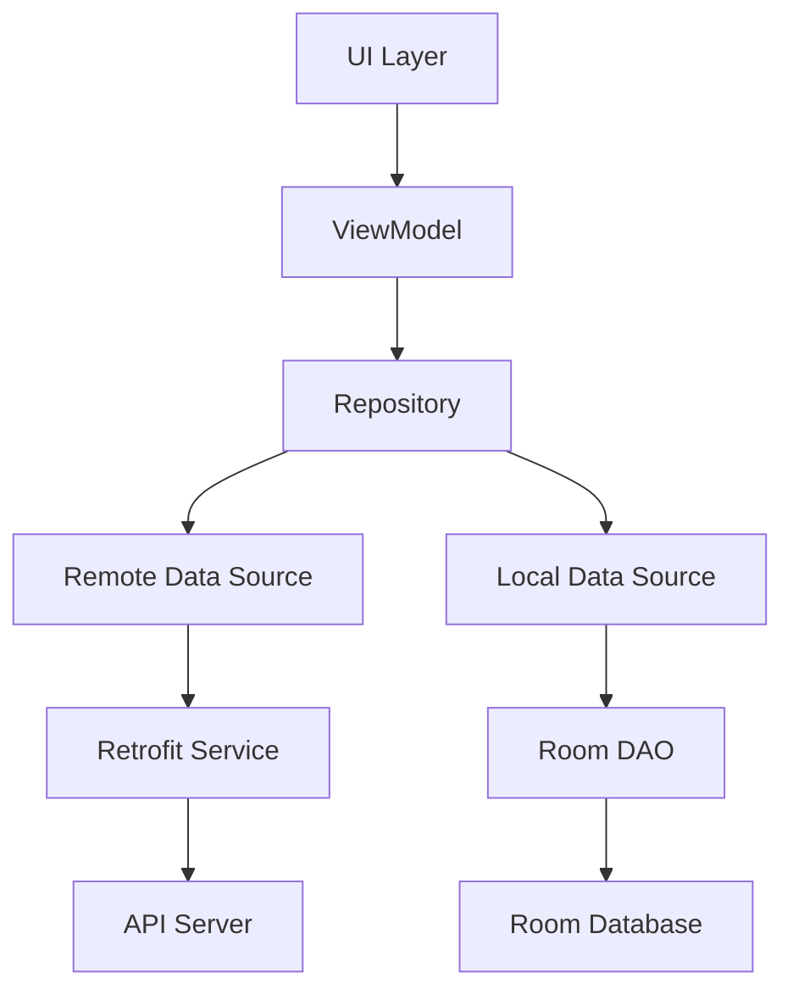

## Overview

NetPOS is built on modern Android architecture principles using **MVVM (Model-View-ViewModel)** pattern with clean architecture separation. The application leverages Dagger Hilt for dependency injection, RxJava2 for reactive programming, and Room for local persistence.

## Core Architecture Patterns

### MVVM Pattern

The app follows the Model-View-ViewModel architecture:

- **Models**: Data entities in `com.woleapp.netpos.model`
- **Views**: Activities and Fragments in `com.woleapp.netpos.ui`
- **ViewModels**: Business logic in `com.woleapp.netpos.viewmodels`

<CodeGroup>
```kotlin View Layer
// MainActivity.kt - View observes ViewModel
class MainActivity : AppCompatActivity() {
    private val viewModel: DashBoardViewModel by viewModels()
    
    override fun onCreate(savedInstanceState: Bundle?) {
        super.onCreate(savedInstanceState)
        observeViewModel()
    }
}
```

```kotlin ViewModel Layer
// AuthViewModel.kt - Business logic
class AuthViewModel : ViewModel() {
    val authInProgress = MutableLiveData(false)
    private val _authDone = MutableLiveData<Event<Boolean>>()
    
    fun login() {
        authInProgress.value = true
        stormApiService.userToken(credentials)
            .subscribeOn(Schedulers.io())
            .observeOn(AndroidSchedulers.mainThread())
            .subscribe { res, error ->
                // Handle response
            }
    }
}
```
</CodeGroup>

## Application Components

### 1. Application Class

The `NetPosApp` class initializes core services at startup:

```kotlin app/NetPosApp.kt
@HiltAndroidApp
class NetPosApp : Application() {
    override fun onCreate() {
        super.onCreate()
        Timber.plant(Timber.DebugTree())
        FirebaseApp.initializeApp(this)
        
        // Initialize NetPos SDK
        NetPosSdk.init()
        NetPosSdk.loadProvidedCapksAndAids()
        
        // Subscribe to Firebase topics
        Firebase.messaging.subscribeToTopic("netpos_campaign")
    }
}
```

<Accordion title="Key Initialization Steps">
  - **Timber**: Logging framework initialization
  - **Firebase**: Push notifications and analytics
  - **SharedPreferences**: Using Prefs library for simple key-value storage
  - **NetPos SDK**: Card reader and terminal configuration
  - **RxJava Error Handler**: Global error handling
</Accordion>

### 2. Dependency Injection

NetPOS uses **Dagger Hilt** for dependency injection, configured in `di/Module.kt:38`:

<CodeGroup>
```kotlin Network Modules
@Module
@InstallIn(SingletonComponent::class)
object Module {
    @Provides @Singleton
    @Named("defaultOkHttpClient")
    fun providesDefaultOkHttpClient(
        @Named("loginInterceptor") loggingInterceptor: Interceptor
    ): OkHttpClient =
        OkHttpClient().newBuilder()
            .connectTimeout(120, TimeUnit.SECONDS)
            .readTimeout(120, TimeUnit.SECONDS)
            .addInterceptor(loggingInterceptor)
            .build()
}
```

```kotlin Service Providers
@Provides @Singleton
fun providesStormApiService(
    @Named("defaultRetrofit") retrofit: Retrofit
): StormApiService = retrofit.create(StormApiService::class.java)

@Provides @Singleton
fun providesZenithPayByTransferService(
    @Named("zenithPayByTransferRetrofit") retrofit: Retrofit
): ZenithPayByTransferService = retrofit.create(ZenithPayByTransferService::class.java)
```

```kotlin Database Provider
@Provides @Singleton
fun providesLocalDataBase(
    @ApplicationContext context: Context
): AppDatabase = AppDatabase.getDatabaseInstance(context)

@Provides @Singleton
fun providesTransactionResponseDao(
    appDatabase: AppDatabase
) = appDatabase.transactionResponseDao()
```
</CodeGroup>

### 3. Network Layer

Multiple API services configured with different base URLs:

<Accordion title="API Services (7 Services)">
  <AccordionGroup>
    <Accordion title="StormApiService">
      Main backend API for authentication, transactions, and merchant data
      - Base URL: Configured via `BuildConfig.STRING_DEFAULT_BASE_URL`
      - Endpoints: `/api/auth`, `/api/token`, `/api/agents/{stormId}`
    </Accordion>
    
    <Accordion title="ZenithPayByTransferService">
      Zenith Bank pay-by-transfer integration
      - Base URL: `BuildConfig.STRING_ZENITH_BASE_URL`
      - Endpoints: `/api/getUserAccount/{terminalId}`, `/api/queryTransactions`
    </Accordion>
    
    <Accordion title="QrPaymentService">
      Contactless QR payment processing
      - Endpoint: `/contactlessQr`
    </Accordion>
    
    <Accordion title="CheckoutService">
      Payment checkout operations
    </Accordion>
    
    <Accordion title="SubmitComplaintsService">
      Customer complaints and feedback
    </Accordion>
    
    <Accordion title="ProvidusMerchantsAccountService">
      Providus Bank merchant account integration
    </Accordion>
    
    <Accordion title="FcmbMerchantsAccountService">
      FCMB Bank merchant account integration
    </Accordion>
  </AccordionGroup>
</Accordion>

### 4. Reactive Programming

NetPOS extensively uses **RxJava2** for asynchronous operations:

```kotlin viewmodels/AuthViewModel.kt:79
private fun auth(username: String, password: String) {
    authInProgress.value = true
    stormApiService.userToken(credentials)
        .flatMap { response ->
            if (!response.success) {
                throw Exception("Login Failed")
            }
            val userToken = response.token
            Prefs.putString(PREF_USER_TOKEN, userToken)
            Single.just(parseUserFromToken(userToken))
        }
        .subscribeOn(Schedulers.io())
        .doFinally { authInProgress.postValue(false) }
        .observeOn(AndroidSchedulers.mainThread())
        .subscribe { res, error ->
            // Handle response
        }
        .disposeWith(disposables)
}
```

<Note>
  All RxJava subscriptions are disposed in ViewModel's `onCleared()` to prevent memory leaks.
</Note>

## Data Flow Architecture



### Example: Transaction Flow

<Steps>
  <Step title="User initiates transaction">
    User taps on transaction type in `MainActivity`
  </Step>
  
  <Step title="ViewModel processes request">
    `TransactionsViewModel` validates input and creates transaction request
  </Step>
  
  <Step title="Transaction processor">
    `TransactionProcessor` communicates with card reader via NIBSS EPMS library
  </Step>
  
  <Step title="Network call">
    Result logged to backend via `StormApiService.logTransactionBeforeConnectingToNibss()`
  </Step>
  
  <Step title="Local persistence">
    Transaction saved to Room database via `TransactionResponseDao`
  </Step>
  
  <Step title="UI update">
    LiveData observers update UI with transaction result
  </Step>
</Steps>

## Key Components

### Activities

<CardGroup cols={2}>
  <Card title="AuthenticationActivity" icon="lock">
    Entry point and user authentication
    - Launched on app start with `LAUNCHER` intent
    - Handles login and password reset
  </Card>
  
  <Card title="MainActivity" icon="house">
    Main dashboard and transaction hub
    - Fragment container for all transaction flows
    - Navigation between features
  </Card>
</CardGroup>

### Services & Receivers

<Accordion title="Background Services">
  - **MyFirebaseMessagingService**: Push notifications from Firebase Cloud Messaging
  - **BatteryReceiver**: Monitors battery status and power connection
  - **BootReceiver**: Handles device boot and shutdown events
</Accordion>

## Configuration Management

NetPOS supports multiple product flavors (white-label configurations):

```gradle build.gradle:104
flavorDimensions "whiteLabels"
productFlavors {
    netpos { dimension "whiteLabels" }
    zenith { 
        dimension "whiteLabels"
        applicationIdSuffix ".zenith"
    }
    wema { applicationIdSuffix ".wema" }
    providus { applicationIdSuffix ".providus" }
    konga { applicationIdSuffix ".konga" }
    heritage { applicationIdSuffix ".heritage" }
}
```

## Threading Model

<CodeGroup>
```kotlin IO Scheduler
@Provides @Singleton
@Named("io-scheduler")
fun providesIoScheduler(): Scheduler = Schedulers.io()
```

```kotlin Main Thread Scheduler
@Provides @Singleton
@Named("main-scheduler")
fun providesMainThreadScheduler(): Scheduler = AndroidSchedulers.mainThread()
```
</CodeGroup>

<Warning>
  Network operations and database queries always run on IO scheduler, with results observed on main thread.
</Warning>

## State Management

ViewModel state is managed using **LiveData** and **MutableLiveData**:

```kotlin viewmodels/TransactionsViewModel.kt:32
val lastTransactionResponse = MutableLiveData<TransactionResponse>()
private val _message = MutableLiveData<Event<String>>()
val message: LiveData<Event<String>> get() = _message

val inProgress = MutableLiveData(false)
val done: LiveData<Boolean> get() = _done
```

<Info>
  Single-use events are wrapped in `Event<T>` class to prevent re-emission on configuration changes.
</Info>

## Build Variants

The application supports two build types:

- **Debug**: Development with verbose logging, signing config enabled
- **Release**: Production with minification and ProGuard

Combined with 12 product flavors, this creates 24 possible build variants.

## External Dependencies

<AccordionGroup>
  <Accordion title="Core Libraries">
    - **Kotlin**: 1.8+ with coroutines support
    - **AndroidX**: AppCompat, Core-KTX, ConstraintLayout
    - **Material Components**: Material Design UI components
  </Accordion>
  
  <Accordion title="Architecture Components">
    - **Lifecycle**: ViewModel, LiveData (v2.6.1)
    - **Room**: 2.5+ for local database
    - **Paging**: 2.1.2 for paginated transaction lists
  </Accordion>
  
  <Accordion title="Dependency Injection">
    - **Dagger Hilt**: 2.48.1
  </Accordion>
  
  <Accordion title="Network & Serialization">
    - **Retrofit**: 2.9.0 with RxJava2 adapter
    - **OkHttp**: 5.0.0-alpha.2 with logging interceptor
    - **Gson**: JSON serialization
  </Accordion>
  
  <Accordion title="Reactive">
    - **RxJava2**: 2.2.21
    - **RxAndroid**: 2.1.1
    - **RxKotlin**: 2.4.0
  </Accordion>
</AccordionGroup>

## Next Steps

<CardGroup cols={2}>
  <Card title="Database Schema" icon="database" href="/reference/database-schema">
    Explore Room database entities and relationships
  </Card>
  
  <Card title="ViewModels" icon="code" href="/reference/viewmodels">
    Detailed ViewModel implementations
  </Card>
  
  <Card title="Services" icon="network-wired" href="/reference/services">
    API services and network layer
  </Card>
  
  <Card title="Security" icon="shield" href="/reference/security">
    Security implementation and encryption
  </Card>
</CardGroup>